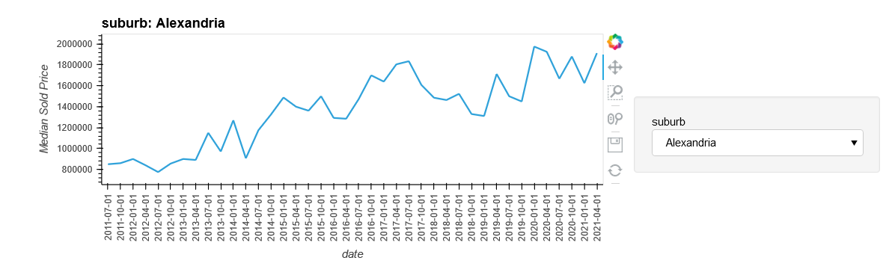
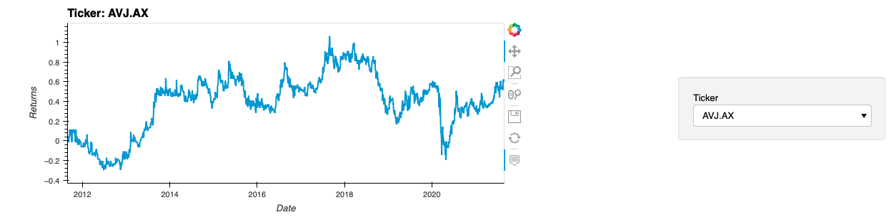
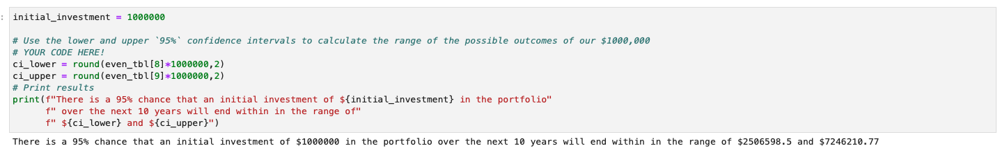

# Fintech Group Project 1: Discovering the Best Property Investment Strategies Over the Past Decade
---
## Group Members: 

Rachel, Terry, Dave

---

## Overview
We asked these questions of our project: 

1. If our life expectancies suggest we have 40+ more years to live and we want to invest in property, should we invest in “Bricks & Mortar” in our own Suburbs? OR…
2. If we can’t afford the deposit for a house in our Suburb, should we invest the same amount of money in a select Property Fund/s? AND...
3. As it is impossible to precisely predict the future we then asked the ultimate question... 

“What should we have invested in 10 years ago to have more money now?”

---

## Imported Libraries

### System Libraries 
* import os
* from pathlib import Path
* from dotenv import load_dotenv

### Data Exploration Libraries
* import json
* import requests
* import re,string,timeit
* import time
* import yfinance as yf
* from pathlib import Path

### Data manipulation Libraries 
* import pandas as pd
* import numpy as np

### Data visualisation Libraries 
* import panel as pn
* pn.extension('plotly')
* import plotly.express as px
* import hvplot.pandas
* import matplotlib.pyplot as plt
* from dotenv import load_dotenv
* import warnings
    - warnings.filterwarnings('ignore')

---

## Data Wrangling
We sourced APIs and datasets for and from below: 

Median sale price : Domain.com API_OAuth 2.0
https://developer.domain.com.au/

NSW postcode list: https://auspost.com.au/business/marketing-and-communications/access-data-and-insights/address-data/postcode-data

NSW suburb coordinates: https://www.matthewproctor.com/australian_postcodes 

ASX share price: Yahoo!Finance market data downloader
https://pypi.org/project/yfinance/

ASX Real Estate & Property Companies:
https://www.listcorp.com/asx/sectors/real-estate

---
## Data Importing
We built some cool code to pull the data we needed as imaged below...

### The we ran the 

## What we discovered
In short, investing in property funds listed on the ASX was a good way to quadruple your money from 2011 to 2021!

We managed to code some cool charts with pyviz that detail our analysis, see below...
## Plots for Bricks & Mortar Investment
### Price per Suburb over past 10 years

Line plots...very vanilla...

#
### Geomap of Median Sales Price per Suburb over past 10 years

Geoplots are really unecessary for this project but still...super sexy!
#
---
## Plots for Property Fund Portfolio

Returns per stock
#

### Accumulated Returns for Evenly Weighted Property Fund Portfolio

FINDINGS: The ROI on $1m passively invested 10 years ago would be over $4m now. This represents a return of over 400%. 
#

## Monte Carlo Simulation run on our selected property funds:

### Output of MCS: 

#

---
## Additional Features
If we have enough time, we would like to build on our dashboard to include all Australian suburbs and all Australian Porperty Funds. Future development could also compare other asset classes such as: 

  Australian commodities, Australian bonds, International shares, Internation bonds, the most popular ETFs, top 10 cryptocurrencies, term deposits, cash, collectibles, etc... 

  Other Technologies we'd like to incorporate into this project to enable better analysis: 
  
